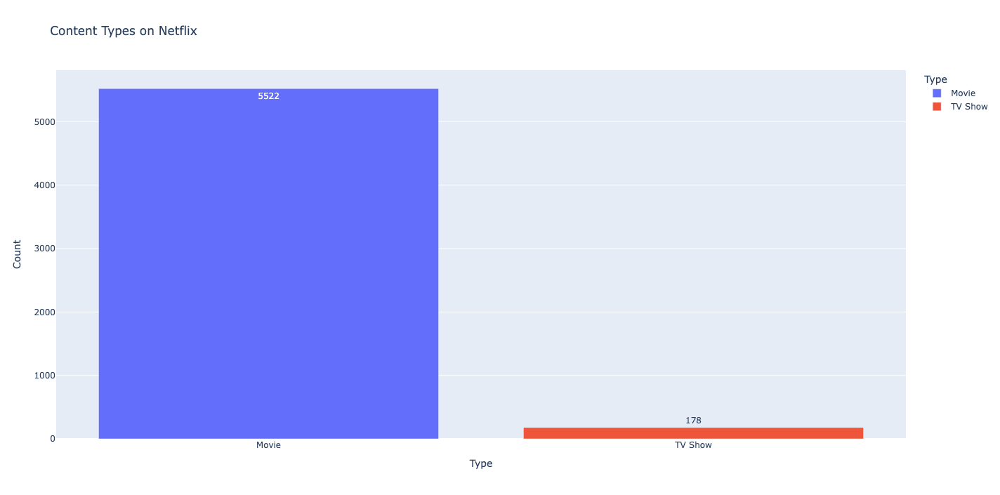
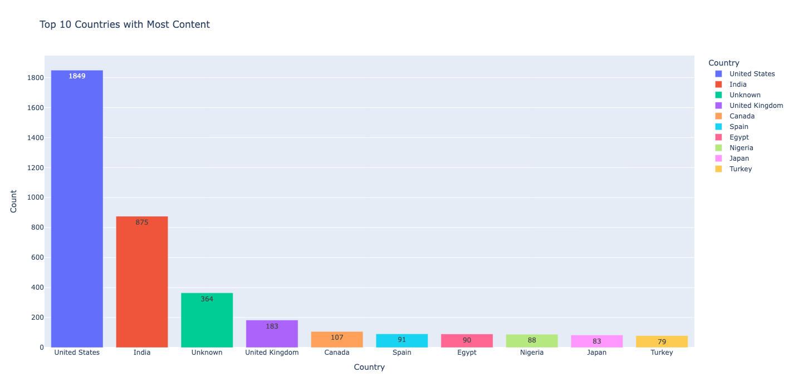
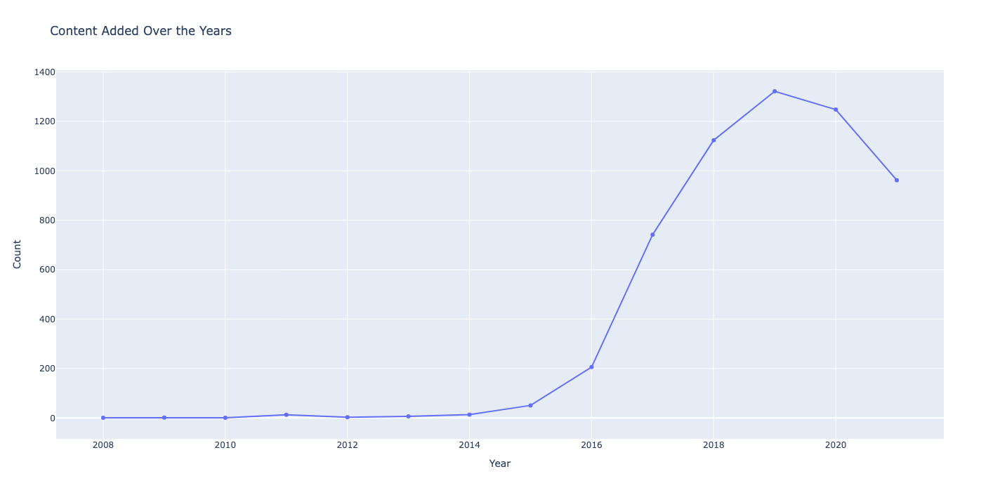
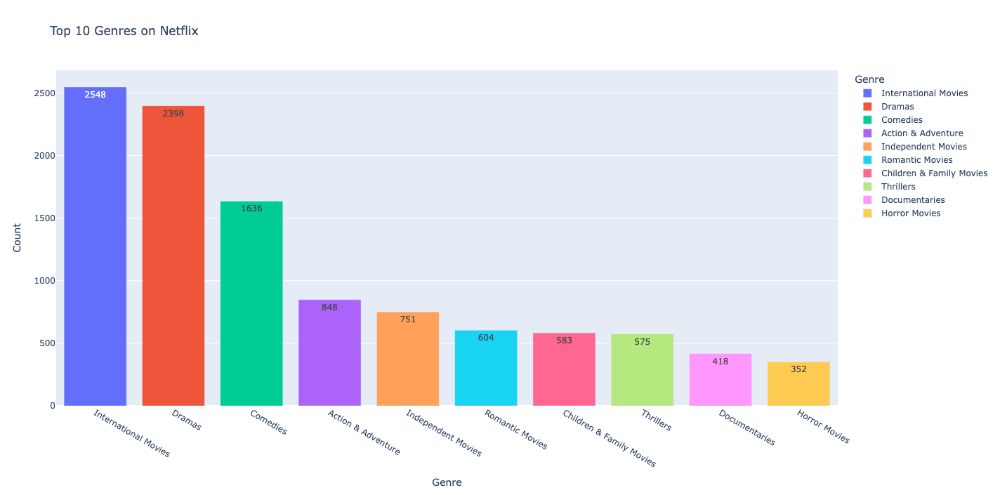
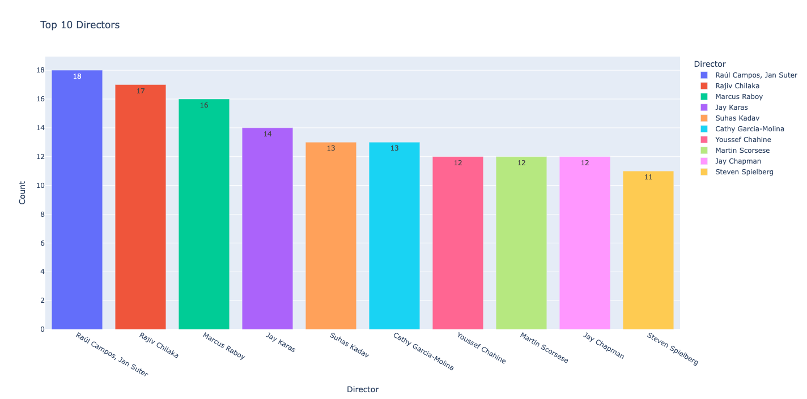
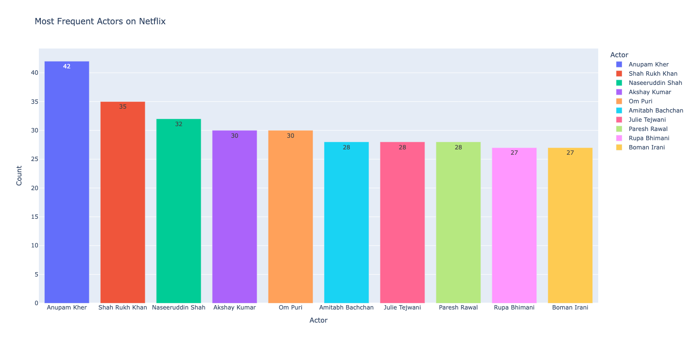

# Netflix Dataset Analysis 📊🎬
Unlocking insights from Netflix's global catalog using Python, Pandas, and data visualization 📈

A Python-based exploratory data analysis (EDA) project on the Netflix titles dataset using Pandas, Matplotlib, Seaborn, and Plotly.
This project provides insights into content distribution, trends, and key contributors on Netflix.

# 🔍 Features & Analysis
✅ Content Type Distribution → Movies vs. TV Shows
🌍 Country-wise Content Distribution → Top 10 content-producing countries
📆 Year-wise Trend → Titles added per year (growth pattern)
🎭 Genre Analysis → Most popular genres
👥 Actor Analysis → Most frequently appearing actors
🎬 Director Analysis → Top 10 directors
🎯 Filtered Analysis → By content type (Movie/TV Show)

## 📂 Dataset Source
Dataset taken from [Kaggle Netflix Titles Dataset](https://www.kaggle.com/datasets/shivamb/netflix-shows)

## 📁 Files:
- `netflix_analysis_plotly`: Python script with analysis and interactive visualizations
- `netflix_titles.csv`: Original dataset (source: Kaggle)

## 🚀 Tech Stack

## 📊 Key Analysis & Outputs

### 🔹 Content Type Distribution
Displays the number of Movies and TV Shows available on Netflix using a bar chart. Helps understand which content dominates the platform.

### 🌍 Top 10 Countries with Most Content
Visualizes the top 10 countries producing the most content on Netflix. Useful for identifying geographical content trends.

### 📆 Year-wise Content Trend
Line chart showing how many titles were added to Netflix each year. Great for understanding platform growth over time.

### 🎭 Top 10 Genres
Breakdown of the most frequent genres on Netflix. Data extracted by splitting the genre column.

### 🎬 Top 10 Directors
Bar chart of the most prolific directors on the platform based on number of titles.

### 👥 Most Frequent Actors
Highlights the most commonly appearing actors across all titles. Extracted from the “cast” column.

## 🔮 Future Improvements

While this project currently focuses on Exploratory Data Analysis (EDA), it can be extended into Machine Learning (ML) applications such as:

- **Recommendation System** → Suggest similar movies/TV shows based on genres, actors, or directors.  
- **Sentiment Analysis** → Scrape and analyze audience reviews to understand viewer opinions.  
- **Content Success Prediction** → Use metadata (cast, genre, country) to predict the likelihood of a title being popular.  
- **Clustering Content** → Apply unsupervised learning (e.g., KMeans, PCA) to group similar titles together.  

These enhancements will transform the project from pure analysis to **data-driven insights + predictive modeling** 🚀

## 📌 Note
All visualizations have been upgraded to **interactive Plotly charts** for a more engaging experience.

